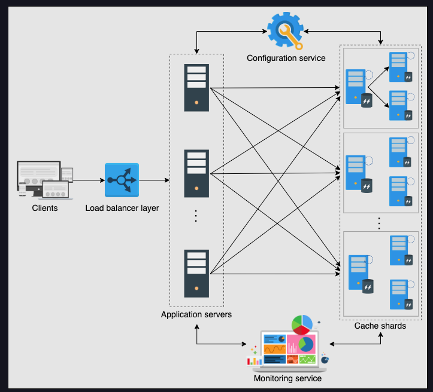
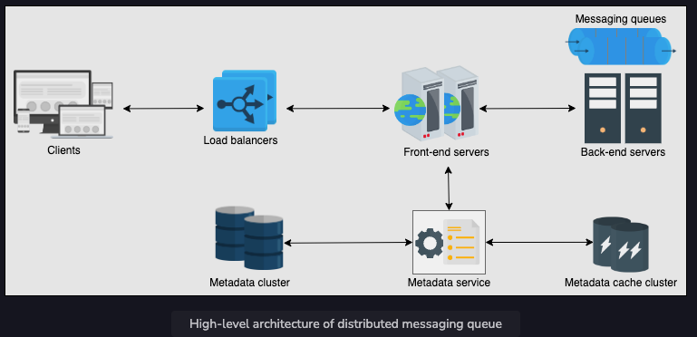
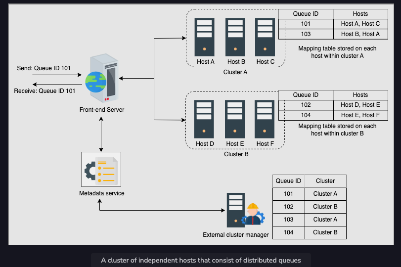
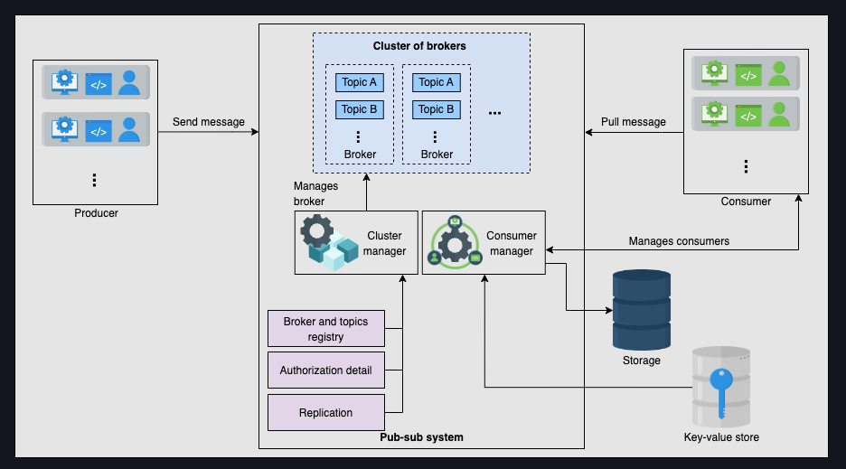
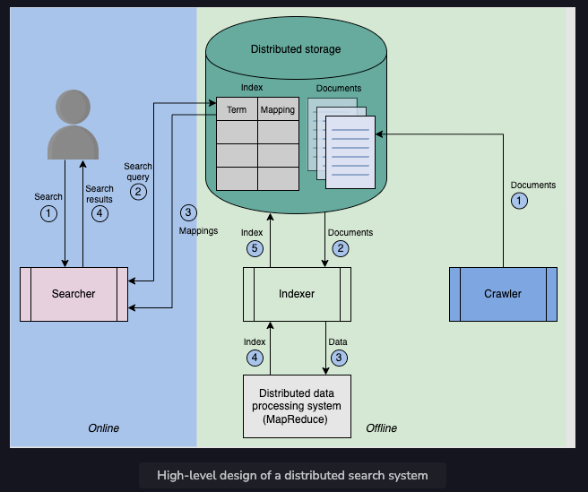
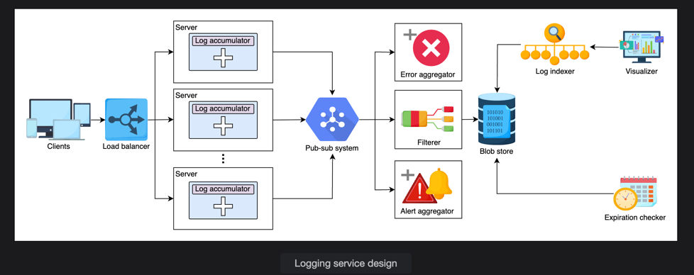
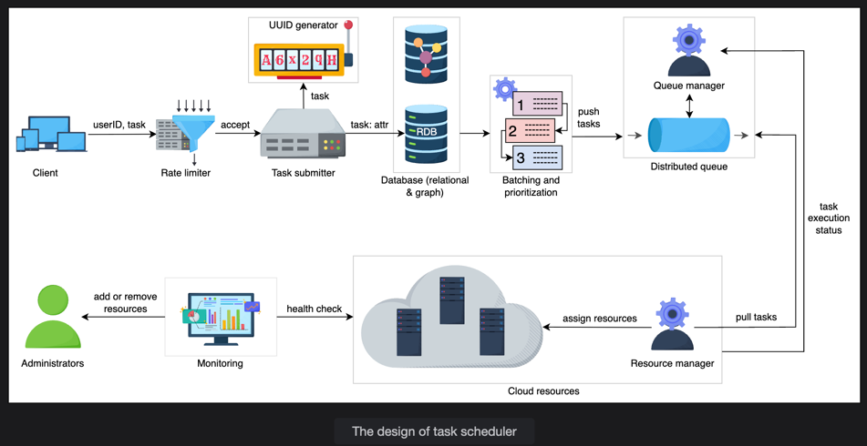

## Distributed Cache
### Writing Policies
- Write-through cache: The write-through mechanism writes on the cache as well as on the database. Writing on both storages can happen concurrently or one after the other. This increases the write latency but ensures strong consistency between the database and the cache.
- Write-back cache: In the write-back cache mechanism, the data is first written to the cache and asynchronously written to the database. Although the cache has updated data, inconsistency is inevitable in scenarios where a client reads stale data from the database. However, systems using this strategy will have small writing latency.
- Write-around cache: This strategy involves writing data to the database only. Later, when a read is triggered for the data, it’s written to cache after a cache miss. The database will have updated data, but such a strategy isn’t favorable for reading recently updated data.

### Eviction Policies
- LRU
- MRU (Most recently used)
- LFU
- MFU
- FIFO

### Cache Invalidation
- TTL and TTR

- LRU cache can be designed using a map and doubly linked list.

## Distributed Messaging Queue

## Pub Sub

## Rate Limiter
#### Rate limiting algorithms
- Token Bucket
  - Number of tokens are refilled in the bucket per unit time.
  - Each request removes one token and decision is made on token availibility in the bucket.
  - Adv - Easy to implement, less storage
  - DisAdv - Locking required
- Leaking bucket
  - Works on outflow rate
  - Keeps outflow counter
- Fixed Window Counter
- Sliding Window
- Sliding window counter
- Sliding window log

- Reject requests with 429 TOO MANY REQUESTS
---

## Blob Store
- Break the blob in chunks and store them sharded and replicated
- Metadata server (Fault Tollerant) maintains the metadata of the blobs
- Replicate the chunks
- Indexing is needed.

---

## Distributed Search
#### Search System
- Crawler
- Indexer
- Searcher
#### Indexing
- ElasticSearch
- Lucene
- Solr

---

## Distributed Logging
- Log Sampling can be done to reduce logging, works for Social Networking where there are huge events but does not work in financial systems.
- Optional - Identify PII data and mask in logging
### Requirements
- Writing logs
- Search logs
- Storing logs
- Visualizer
- Low latency
- High Availability
- Scalability
### Building Blocks
- PubSub or Kafka
- Distributed Search
- Blob Storage
### Design
- Log Collector
- Log Accumulator
- Kafka - Deletion policy set to frequent deletion
- Storage
- Indexer
- Visualizer

---

## Distributed Task Scheduler

- Put tasks in queues depending on priority - Urgent / Less Urgent / Periodic

---

## Sharded Counters
- Counting Likes, Comments and Views
- Need high scalability
- 

