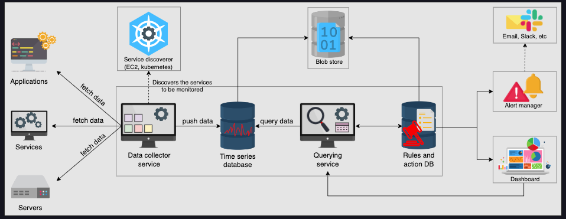

## Domain Name System
- Name Servers
  - Responds to user Queries
- Resource Records
    - Database of url and ip mapping
    - Types
      - A = hostname - ip (server.abc.com - 192.168.0.0)
      - NS = Domain Name - hostname (abc.com - server.abc.com)
      - CNAME = Alias to canonical hostname (abc.com - server1.primary.abc.com)
      - MX = Mail server - CNAME

---

## Load Balancing
### Load Balancer Provides following capabilities
- Scalability
    - Upscaling and Downscaling is transparent to end user
- Availability
    - Hide faults and failure of servers. If some servers go down, system is still functional
- Performance
    - Improves performance and resource utilization
- Health Checking - using heartbeat
- Predictive Analytics - Predict traffic patterns
- Service Discovery
- Security

#### Global Server Load Balancer
- Balance the requests to different regions
#### Local Load Balancer
- Withing Data center

### Algorithms of Load Balancers
- Round Robin
  - Widely used
  - Easy
  - Limitations
    - Uneven load distribution in case of GSLB
    - Does not consider server crashes, if the IPs are cached
- Weighted Round Robin
- Least Connection
- Lease response Time
  - In performance sensitive scenarios
- IP Hash
- URL Hash

### StateFull and StateLess Balancing
- Stateful Load balancer maintains state of the session
  - Retail a data structure to map clients to hosting server
  - Limit Scalability
- Stateless is faster and lightweight
  - Uses consistent hashing

---

## Databases
### Relational Databases
- Provides ACID properties
  - Atomicity - Transaction
  - Consistency - Consistent results every time
  - Isolation - All transactions work in isolation
  - Durability - Completed transactions will be permanent in database
- Drawbacks
  - Storing complex data requires multiple tables and multiple rows

### Non-Relational Databases (NoSQL)

- Used for semi structured and unstructured data.
- Low latency
- Horizontal Scaling
- Cost
- Types
  - Key-Value Store
    - Easy partitioning  and scaling
    - e.g. Redis
  - Document Store
    - Stores documents in formats like XML, JSON
    - Product in e-commerce, blogs etc.
    - e.g. MongoDB, Firestore
  - Columnar
    - Stores data in columns instead of rows
    - Used in aggregations and analytics
    - e.g. Cassandra, HBase
  - Graph
    - Relationships between entities
    - Social networking
    - e.g. Neo4j
- Drawbacks
  - Lack of Standardization
  - Weak consistency

Choice
- Structured Data, ACID Required and Small data Size = SQL
- Unstructured Data, Ser-Deser required, Large Data Size = NoSQL

## Data Replication
### Data Replication models
- Primary Secondary
  - Appropriate when use case is read heavy
  - Problem when using Async Replication
- Multi Leader Replication
  - Multiple readers sending writes to secondary
  - Problem of conflicts
  - 
- Peer to Peer / Leaderless Replication

## Data Portioning
- Vertical Sharding
  - Data is divided into multiple tables or different tables are kept on different shards
  - Tables with joins are kept in single shard
  - Manual Partitioning
- Horizontal SHarding
  - Key-Range based Sharding
    - Sharded on a key
    - For multiple tables use foreign key as shard key so that all related data is in one shard
    - Disadvantage id the query uses something other that shard key.
  - Hash based sharding
    - Consistent Hashing
      - Assigns each server a place on hash table - ring
      - This is easy to scale

- Rebalancing
  - Avoid hash mod num of servers
    - If you add or remove server rebalancing becomes difficult
  - Fixed number of Partitions
    - Nodes can take over or loose some partitions
  - Dynamic Partitioning
    - If the size reaches a certain threshold,d the partition is split
  - Partitions proportionality to nodes
    - Each nodes has fixed partitions
    - Partition grows/shrinks when data grows/shrinks
    - When a node is added it splits some partitions and take certain partitions.
  
---

## Key-Value Store
- Used for storing user sessions or temp information
- e.g. - Shopping carts, customer preferences, product catalogs
- Can be used for concurrency management

### Consistent Hashing
- Nodes are added to a conceptual ring.
- Hashing Algorithm calculates the hash maps it to the ring and moves clockwise until it finds a server to process
- If new node is added, the next nodes shares its keys with it.
- So minimum number of keys are moved
- This might lead to non-uniform distribution and server with more loads are called hotspots
  - Add Virtual Nodes
  - Calculate 3 hashes so 3 locations on ring
  - Request uses only 1 hash function

---
## Content Delivery Network (CDN)

---
## Distributed Sequencer
### UUID
- Might Have collisions
- Scalable
- Available
### Central Database
- Unique for single instance, might not be unique for multiple instances
  - e.g. every DB increments by number of servers
- Scalable
- Available
### Range Handler
- Each server has a specified range
- Unique
- Available
- Non incremental

---
## Distributed Monitoring
### Server Side errors

### Client Side errors
- Use probes embedded in the client application.
- Send data do a different collector/monitoring service
- Do not use DNS to protect user privacy.