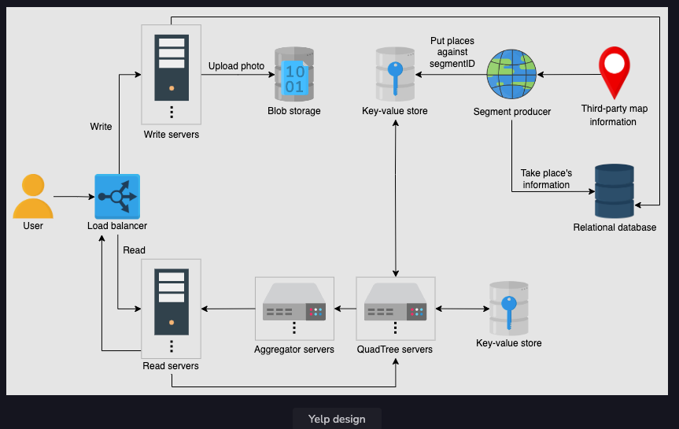
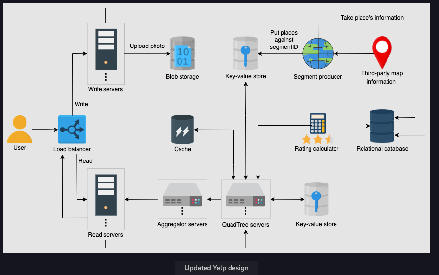
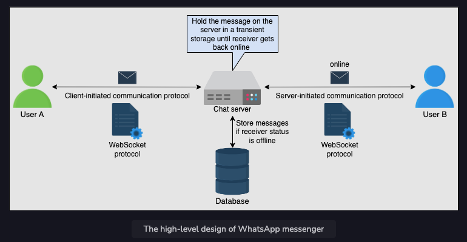
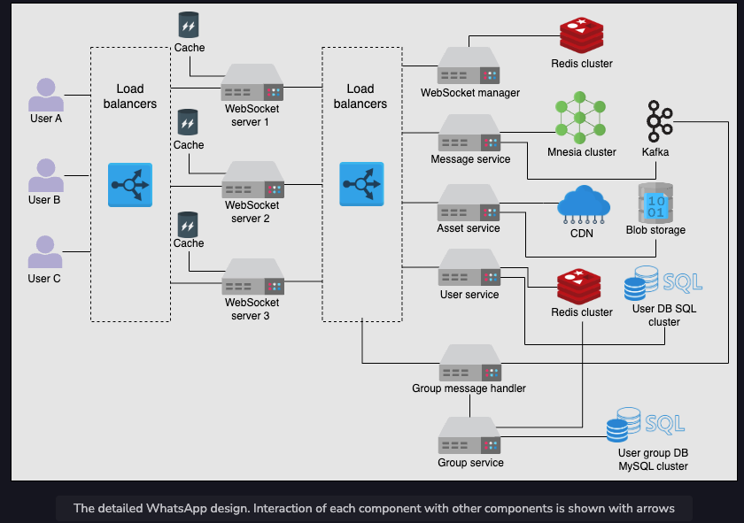
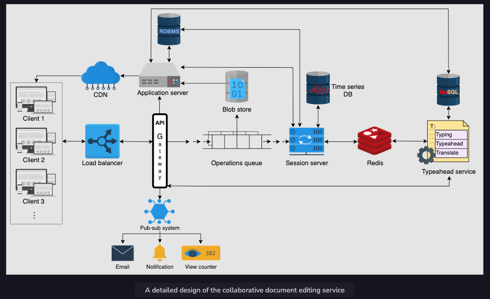
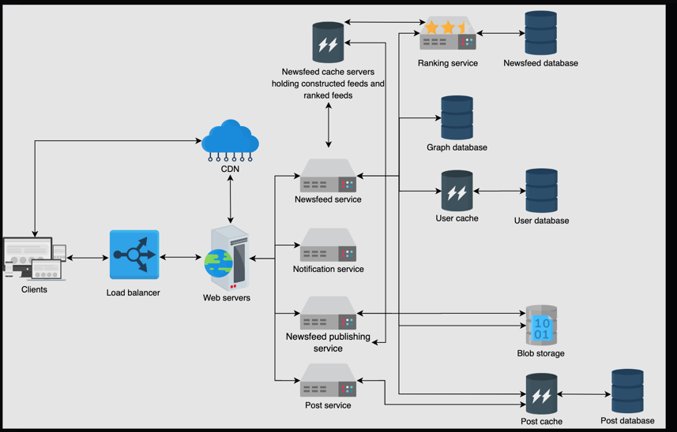
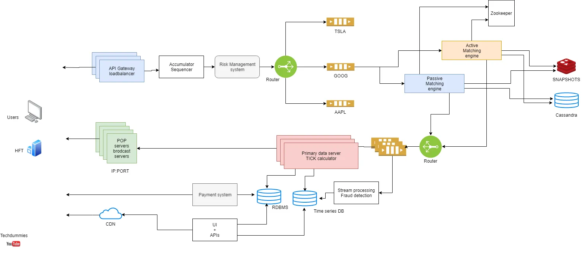

## Design Yelp
#### Requirements
- Functional
- NFRs
  - High Scalability
  - Fault Tolerance
  - High Availability
  - Consistency in users and auth
    - Can be weak in places and reviews
  - Low latency
#### Estimation
#### Storage schema
- Place
- Place Info
- Categories
- Users
- Reviews
#### High Level Design
- Load Balancer
- Database 
  - SQL
- Distributed Cache
- Distributed Messaging Queue
- Blob Storage
- Application Server
- Monitoring
#### API design
#### Detailed Design

- Third Party Maps
- Quad Tree Servers
  - finds a place using location and radius
  - Quad tree is tree with 4 nodes- used to represent 2D maps
- Data Structure
  - Quad Tree
  - When number of places exceeds by a value then we split the segment in quad tree
  - This process can be repeated
  - This gets us more dense quad trees in urban areas and less in rural
  - easier for search
- Databases
  - SQL for Entities
  - Key value stores for search and quad tree
- Divide the maps into segments and place the places
  - Searching in small segments is easier and faster

#### Evaluation
#### Distinctive component

---

## Design Whatsapp
#### Requirements
- Functional
  - One to One and Group Conversations
  - Ack - sent delivered read
  - Sharing media files
  - persistent storage
  - Notifications
- NFRs
  - Scalability
  - Low latency
  - Fault Tolerance
  - Consistency
  - Security
  - High Availability
#### Estimation
#### Storage schema
#### High Level Design
- Load Balancer
- Database
  - SQL
- Blob Storage
- Messaging queue
- Application Servers
- CDN (Frequently accessed media)

#### API design
- Send message
- Get Message
- Upload File
- Download  file
#### Detailed Design
- WebSockets
  - Websocket protocol keeps the connection open between client (who is online) and server
  - For billions of users we need a lot of servers
  - Websocket manager maintains the mapping and connections
- Do not use websockets for media as they are built for small dataset
- Encryption using asymetric keys

#### Evaluation
#### Distinctive component

---

## Design Google Docs
#### Requirements
- Functional
  - Multiple uses reading and editing documents simultaniously
  - Conflict resolution
  - Word Suggestion
  - Views
  - History
- NFRs
  - High Scalability
  - Fault Tolerance
  - High Consistency
  - High Availability
  - Low latency
#### Estimation
#### Storage schema
#### High Level Design
- Load Balancer
- Database
  - SQL for user info
  - No SQL for documents
    - We can store data in JSON or Markdown format
- Blob Storage
- Application Servers
- Cache
- Messaging Queue and Topic
- CDN
- Cache
- Websockets
- Monitoring

#### API design
- Create
- Edit (position(x,y), value, operation)
- Delete
- Get Document
#### Detailed Design
- Concurrency
  - Conflict Resolution
    - Operational Transformation
      - Lock free and non-blocking
      - Executes the operations in order and notifies all users
      - Challenging to develop
    - Conflict Free Replicated Data Type (CRDT)
      - Complex Data Structure but easy algorithm
- Websocket servers and Server manager to be added
  - Each server has local cache
#### Evaluation
#### Distinctive component

---

## Design NewsFeed
#### Requirements
- Functional
  - Generation - Generate from vast content that user follows
  - Content can be text, images, videos
  - Ranking
  - Display
- NFRs
  - High Scalability
  - Fault Tolerance
  - High Availability
  - Low latency
#### Estimation
  - 500M Daily active users
    - 10 Req per day per user = 5B / 24*3600 = Approx 58K req per sec
    - Back of the envelope = 500M / 8000 serves
    - Storage
      - 500M posts - 1 Text 50 KB = 25 TB Text
      - 500M / 5 Posts have 2MB media = 200 TB Media 
#### Storage schema
#### High Level Design
  - Load Balancer
  - CDN
  - Database
    - NoSql
  - Blob Storage
  - Cache
  - Messaging
#### API design
  - Create Post
  - Generate News Feed (Precalculated News Feed)
    - Can be API + Asyn call through Messaging
    - Think about Users frequency of viewing news feed to pre-generate the feed
  - View News Feed
#### Detailed Design
  - Ranking Service
    - Works on things such as, a user’s past history, likes, dislikes, comments, clicks etc.
    - Select “candidates” posts to show in a newsfeed.
    - Eliminate posts including misinformation or clickbait from the candidate posts.
    - Create a list of friends a user frequently interacts with.
    - Choose topics on which a user spent more time.
    - This is computation heavy so more CPU power needed
  
#### Evaluation
#### Distinctive component

---

## Design NewsFeed
#### Requirements
#### Estimation
#### Storage schema
#### High Level Design
#### API design
#### Detailed Design

#### Evaluation
#### Distinctive component
