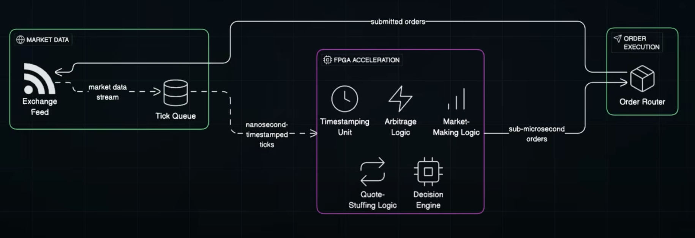

## Design System to Process 1M messages per second
#### Requirements
- Functional
  - Process 100K Messages Per Seconds
  - Distribute to 10k Clients
  - Handle slow Clients
- NFRs
    - High Scalability
    - Fault Tolerance
    - High Availability
    - Low latency
#### Estimation
- Assume 1 req take 10 millis to process
  - 100 req per second by 1 process | Multithreading 10 => 1000 Req per sec per server
  - 100 Partitions and 100 Consumers
#### Storage schema
#### High Level Design
- Producers
- Kafka
- Application Servers (Consumers - Batch processing + Executors)
- Distribute via different consumers for continuous stream - 1 consumer group per client
  - Multiple consumer Groups can run on same server
  - Use Websockets for continuos stream if its PUSH
  - Drop old message from websocket buffer if a particular client is slow
- Observability - Alerts and Logs (Grafana)
#### API design
#### Detailed Design
- Use protocol buffer for serialization as it reduced message size
- Websockets subscribes to kafka Topic
- SSL for Websockets
- Monitor consumer lag, health, websokect connections and metrics, droppeed messages
- Reporting
  - System Throughput
- Use K8s
#### Evaluation
#### Distinctive component

---

## Design HFT System
https://www.youtube.com/watch?v=iwRaNYa8yTw&list=PLJq-63ZRPdBvQnN9YQlpe5dKKg56MDpx4
#### Requirements
- Functional
  - Profit using spread
- NFRs
    - Ultra Low latency
    - High Accuracy
    - High Consistency
    - Reliability
#### Estimation
#### Storage schema
#### API design
#### Detailed Design
- Market Data Capture (Use colocated servers of exchange)
- Works on UDP

- Processing Market Data

  - FPGA (Field Programmable Gate Array)
    - Run without CPU (Tick to Trade execution)
  - Use lock free queue
- Market Making Strategy Engine  

  - Constatantly recalculate spread
  - Once the decision made put out and order to smart order router
- Routing and Placing order 

  - Pre Trade Checks - Check risk and Overspend etc,
  - Decision of where to put the order
- Audit and Analysis (Post Trade)
  - Order sent and status updates
  - Capture latency data performance metrics, post trade analysis

#### Low Latency
- Take advantage of RAM or CPU Cache
- Think about warmup of system and GC if Java
#### Reliability
- Distribute on each instrument or Pair (BTC_EUR, AAPL at NASDAQ, AAPL at SOME_EXCHANGE)
#### Evaluation
#### Distinctive component

---

## Design Stock Broker
- Handle order cancellations first with exchange and then communicate to user
- Think about idempotency
  - can be done with idempotency key like exchangeOrderID otherwise retry
- Need RDBMS bcoz of consitency
- Display Price of Share - Take Average accross exchanges or display according to exchange
  - Get price info (market data) from exchanges via UDP
  - Create the price by throttling or get weighted average or aggregated by some time
  - Use cache to display price
  - Use Time Series DB
