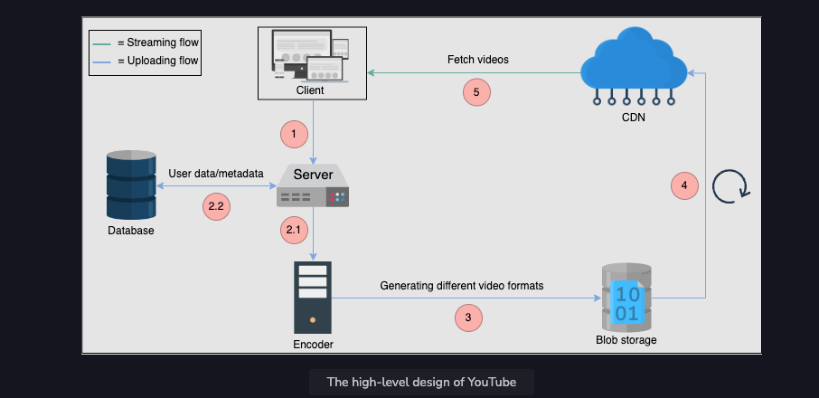
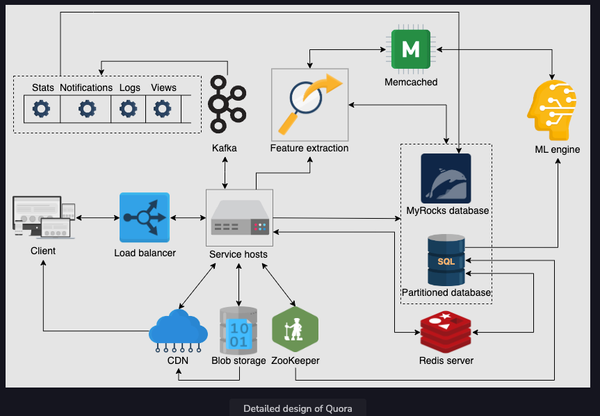
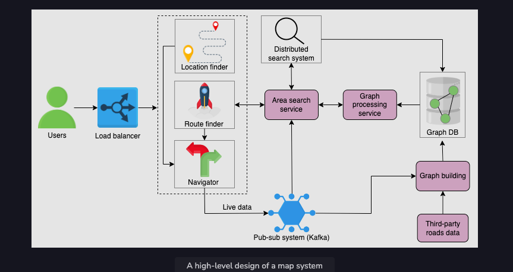

## Design youtube
#### Requirements
- Functional
- NFRs - Scalability, Fault Tolerance, Consistency etc
#### Estimation
#### Storage schema
#### High Level Design
#### API design
#### Detailed Design
#### Evaluation
#### Distinctive component

## Design Youtube
#### Requirements
- Functional
- NFRs 
    - Highly scalable and Fault Tolerance
    - weak Consistency is ok
    - Highly available
#### Estimation
- Servers needed = Req per sec / 8000
#### Storage schema
- Tables
  - User (Id, email, username, password, age, audit columns)
  - Video (id, title, description, likes, dislikes, views, URI, ageRestricted, audit columns)
  - Comments (id, videoId, commentText, parentComment, audit columns)
#### High Level Design
- Building Blocks
  - Load Balancer
  - Blob storage
  - CDN
  - Database
  - Encoders

#### API design
#### Detailed Design
#### Evaluation
- Trade-offs
  - Weak consistency
    - If we want more consistency for user data we can move it to SQL
  - Can not handle Duplicate Videos
    - Can run reporting on replicated DBs with hashing and video matching algorithms
#### Future Scaling
- Geographical Replication
- CDN with geo replication
- Scaling every layer
- Using distributed cache
#### Distinctive component
- Divide the video into chunks and encode ans store separately
- This can be done in parallel processing 
#### Monitoring
- Analytical DB for reporting - Async
- Datadog log analysis
- Sentry

---

## Design Quora
#### Requirements
- Functional
- NFRs
  - Highly Scalable
  - Need consitance but not high
  - High availability
  - Low latency
#### Estimation
- 300 M users 20 req per day
  - 69000 req per sec
  - Avg 8000 RPS - Num active users / 8000 = 37000 servers
- Storage
  - 1 question per day which takes 1 KB
  - 15 % images of avg 500KB = 22.5 TB
  - 5 % Videos of avg 5 MB = 75 TB
  - Total 100 TB Per Day
#### Storage schema
#### High Level Design
- Building blocks
  - Database 
    - SQL for user and question info 
    - NoSQL for Ranking and search
    - OR BigQuery
  - Load Balancer
  - Distributed Search
  - Blob for Image and Video Storage
  - Messaging queue for Async Communication
  - Rate limiters
  - Monitoring Servers
  - Cache
  - Application servers
    - Providing functionality
    - ML for ranking
#### API design
#### Detailed Design

- Vertical Sharding
- Kafka
- Long polling
  - Transfers control to server side and makes client wait until the info is available.
  - reduced request load
  - but keeps connections alive for long time
  - Websockets can be used but are overkill here.
#### Evaluation
- Trade-offs
  - NLP
  - Type Ahead
  - Spelling mistakes
#### Distinctive component

---

## Design Google Maps
#### Requirements
- Functional
  - Identify Currebt location
  - Recommend fastest route
  - Give Directions
- NFRs
  - High availability
  - Low latency
  - Scalability
  - Fault Tolerance
  - Consistency
  - Accuracy
#### Estimation
- Storage
  - One time storage with less updates
  - Read heavy
#### Storage schema
#### High Level Design
- Load Balancer
- Graph DB (Maps) and SQL DB (User info and metadata)
- Distributed search
- Distributed Cache
- Messaging System for updating maps and notifications (accidents, road closures)
- Application Servers
- Monitoring

#### API design
#### Detailed Design
- Graph processing is resource intensive so graph can be divided into small graphs and treversed.
- 
#### Evaluation
#### Distinctive component